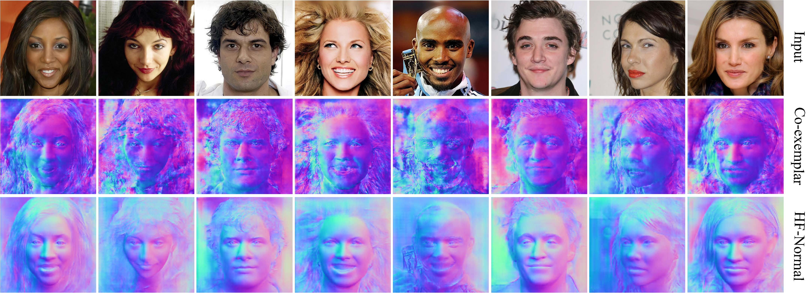

# EB-FNR
This repository contains an implementation for the paper "Exemplar-based Face Normal Estimation".

The paper propose a coarse-to-fine framework that can effectively predict normals from face images in-the-wild. More concretely, we first build a model using limited training data to obtain a coarse (low-quality) normal map of a real face image.

<center></center>
From top to bottom are the input face, predicted albedo, predicted shading, visualized light and predicted normal.


## Usage
### Coarse prediction network training
#### Training data: 
* [Photoface data](https://uwe-repository.worktribe.com/output/972508)

For coarse prediction network training run:
```
python coarse_stage/train.py 
```

### Refined network training
#### Training data: 
* [300W](https://ibug.doc.ic.ac.uk/resources/300-W/)
* [FFHQ](https://drive.google.com/drive/folders/1u2xu7bSrWxrbUxk-dT-UvEJq8IjdmNTP) 
* [CelebAMask-HQ](https://github.com/switchablenorms/CelebAMask-HQ)


For coarse prediction network training run:
```
python refined_stage/train.py 
```


### Testing
#### Download checkpoints: 
* [cpkts](https://drive.google.com/drive/folders/17zJ15oktJFwoVwutsZ5MaUdND4uoUy7b?usp=sharing)

For testing run:
```
python test_stage/genFaceNormal.py 
```
